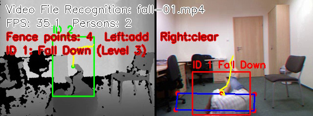

<div align="center">

# Anomaly-Detection-System

**基于摄像头的室内异常行为识别系统**

[](./README_en.md)
[](./README.md)

</div>

## 一、项目简介


系统面向智能家居、室内机房、实验室、儿童活动区、工业室内操作台等室内安全管控场景，利用摄像头实时采集视频画面，通过人体检测、虚拟围栏、目标跟踪和行为规则判断，实现对异常行为的识别与预警。

传统物理围栏存在部署固定、灵活性差、智能化程度低等问题。本系统通过软件方式绘制虚拟安全区域，可根据实际场景灵活调整监控边界，并对人员违规闯入、长时间滞留、翻越围栏、摔倒、奔跑打闹、攀爬等异常行为进行检测。

## 系统演示

### 摔倒检测



### 违规闯入与翻越围栏检测


## 二、设计任务

系统要求实现以下主要功能：

1. 摄像头实时视频采集与显示。
2. 基于目标检测模型识别画面中的人体目标。
3. 支持用户自定义虚拟安全围栏边界。
4. 实时判断人员是否进入虚拟围栏区域。
5. 对人员进行目标跟踪，记录人员 ID 和运动轨迹。
6. 识别异常行为，包括：
   - 违规闯入
   - 翻越围栏
   - 长时间滞留
   - 摔倒
   - 奔跑打闹
   - 攀爬
7. 触发异常行为预警提示。
8. 保存报警截图和报警记录。
9. 选做功能：
   - 视频保存与回放
   - 多级预警
   - 图形化操作界面

## 三、系统总体框架

系统整体流程如下：

```text
+------------------+
|   摄像头/视频源   |
+--------+---------+
         |
         v
+------------------+
|   OpenCV视频采集  |
+--------+---------+
         |
         v
+------------------+
|    YOLO人体检测   |
+--------+---------+
         |
         v
+------------------+
|  目标跟踪与轨迹分析 |
+--------+---------+
         |
         v
+------------------+
|  虚拟围栏区域判断  |
+--------+---------+
         |
         v
+------------------+
|  异常行为规则识别  |
+--------+---------+
         |
         v
+------------------+
|  报警提示/截图/记录 |
+------------------+
```

核心处理流程：

```text
读取摄像头画面
    -> 检测人体目标
    -> 分配人员 ID
    -> 记录运动轨迹
    -> 判断是否进入围栏
    -> 判断是否存在异常行为
    -> 显示报警信息并保存记录
```

## 四、项目结构设计

当前项目结构如下：

```text
Anomaly-Detection-System/
|
|-- main.py                  # 程序入口
|-- ui_main.py               # PyQt6 主界面
|-- detector.py              # YOLO 人体检测模块
|-- tracker.py               # 目标跟踪模块
|-- fence.py                 # 虚拟围栏绘制与区域判断
|-- behavior.py              # 异常行为识别模块
|-- alarm.py                 # 报警、截图和记录模块
|
|-- models/                  # 模型文件目录
|   |-- yolov8n.pt
|
|-- records/                 # 运行记录目录
|   |-- screenshots/         # 报警截图
|   |-- alarm_log.csv        # 报警日志
|
|-- TrainVedio/              # 默认视频选择目录
|-- README.md                # 项目说明文档
|-- requirements.txt         # Python 依赖列表
```

## 五、功能模块说明

### 1. 视频采集模块

使用 OpenCV 调用摄像头或读取本地视频文件，实现实时视频帧采集。

主要功能：

- 打开摄像头。
- 读取实时画面。
- 支持本地视频测试。
- 将视频帧传递给检测模块。

### 2. 人体检测模块

使用 YOLO 模型检测视频画面中的人体目标，只保留 `person` 类别。

主要功能：

- 加载 YOLO 模型。
- 对每一帧图像进行人体检测。
- 输出人体边界框、置信度和类别信息。
- 在画面中绘制人体检测框。

### 3. 虚拟围栏模块

支持用户通过鼠标点击方式绘制虚拟安全区域。

主要功能：

- 鼠标左键添加围栏顶点。
- 鼠标右键清空围栏。
- 将多个点连接成多边形区域。
- 判断人体中心点是否位于围栏内部。

### 4. 目标跟踪模块

对检测到的人体进行编号和轨迹记录。

主要功能：

- 为每个人分配唯一 ID。
- 记录人员中心点历史轨迹。
- 计算人员移动速度。
- 判断人员是否跨越围栏边界。

### 5. 异常行为识别模块

根据检测框、轨迹、速度、停留时间等信息进行规则判断。

异常行为判断规则示例：

| 异常行为 | 判断依据 |
| --- | --- |
| 违规闯入 | 人体中心点进入虚拟围栏区域 |
| 翻越围栏 | 人员从围栏外进入围栏内，轨迹穿过围栏边界 |
| 长时间滞留 | 人员在围栏内停留时间超过阈值 |
| 摔倒 | 人体框宽高比异常，且连续多帧保持低矮姿态 |
| 奔跑打闹 | 人员移动速度超过阈值，或多人距离过近且快速移动 |
| 攀爬 | 人体位置持续上移，或上半身高度变化明显 |

### 6. 报警模块

当系统检测到异常行为时，触发报警提示。

主要功能：

- 在画面中显示报警文字。
- 保存报警截图。
- 记录报警时间、类型、人员 ID 和截图路径。
- 支持不同级别预警。

### 7. PyQt6 界面模块

通过 PyQt6 制作图形化界面，提升系统可操作性。

界面可包含：

- 实时监控画面。
- 识别方式选择按钮。
- 播放按钮。
- 退出识别按钮。
- 报警记录查看按钮。
- 报警记录表格。
- 当前报警状态显示。

## 六、技术栈

| 技术 | 作用 |
| --- | --- |
| Python | 系统主要开发语言 |
| OpenCV | 摄像头读取、图像处理、视频显示、区域绘制 |
| PyQt6 | 图形化界面开发 |
| YOLOv8 | 人体目标检测 |
| NumPy | 坐标计算、数组处理 |
| CSV | 报警记录存储 |

后续可扩展技术：

| 技术 | 可扩展功能 |
| --- | --- |
| OpenCV VideoWriter | 保存带识别框的视频 |
| SQLite / MySQL | 报警记录查询、统计和长期存储 |
| MediaPipe Pose / YOLOv8-Pose | 基于人体关键点的摔倒、攀爬识别 |

## 七、推荐依赖

当前 `requirements.txt` 中的主要依赖：

```text
opencv-python
numpy
PyQt6
ultralytics
```

## 八、实现步骤

建议按照以下顺序逐步完成系统：

1. 实现摄像头实时读取。
2. 接入 YOLO，检测人体目标。
3. 实现鼠标绘制虚拟围栏。
4. 判断人员是否进入围栏。
5. 加入目标跟踪，记录人员 ID 和运动轨迹。
6. 实现长时间滞留和翻越围栏判断。
7. 实现摔倒、奔跑、攀爬等异常行为判断。
8. 加入报警截图和报警记录功能。
9. 制作 PyQt6 图形界面。

## 九、最小可行版本

为了保证课程设计能够顺利完成，建议先实现最小可行版本：

```text
摄像头实时读取
    + YOLO 人体检测
    + 鼠标绘制虚拟围栏
    + 闯入报警
    + 报警截图保存
```

完成最小可行版本后，再继续扩展：

```text
目标跟踪
长时间滞留检测
翻越围栏检测
摔倒检测
奔跑检测
攀爬检测
PyQt6 图形化界面
```

当前系统已完成上述主体功能。后续可继续扩展：

```text
识别后视频保存
历史视频回放
多级预警
基于姿态关键点的动作识别
数据库存储与查询
```

## 十、预期成果

项目完成后，系统应能够实现：

- 实时显示摄像头画面。
- 检测并标注画面中的人体。
- 用户可自定义虚拟安全围栏。
- 人员进入危险区域时自动报警。
- 对异常行为进行规则识别。
- 保存报警截图和报警记录。
- 通过图形界面完成基本操作。

## 十一、当前最小系统

当前代码已实现一个基于 PyQt6 界面的人物动作识别最小系统，包含以下功能：

- 摄像头或视频文件读取。
- YOLOv8 人体检测，未加载成功时自动退回 OpenCV HOG。
- 基于位置、尺寸和颜色直方图特征的目标跟踪。
- 人员 ID 分配和同一人物持续定位。
- 摔倒检测。
- 奔跑检测。
- 攀爬检测。
- 多级预警显示。
- 报警截图保存。
- 报警日志记录。
- 初始界面提示“请选择识别方式”。
- 右侧按钮选择摄像头识别或文件夹视频识别。
- 文件夹视频识别默认打开 `TrainVedio` 目录，由用户自由选择单个视频文件。

### 运行方式

安装依赖：

```bash
pip install -r requirements.txt
```

启动图形化界面：

```bash
python main.py
```

### 操作说明

```text
程序启动后：视频画面框显示“请选择识别方式”
识别方式选择 -> 摄像头识别：打开摄像头进行实时识别
识别方式选择 -> 文件夹视频识别：默认打开 TrainVedio 文件夹，手动选择一个视频
选择视频后：先显示第一帧，不自动播放
视频画面内鼠标左键添加虚拟围栏点
视频画面内鼠标右键清空虚拟围栏
播放：开始识别所选视频
视频识别完成后：再次点击播放可重新识别同一个视频
报警记录：打开图形化表格窗口查看历史报警 CSV
退出识别：停止当前识别并返回主页面
右上角 ×：退出整个程序
```

文件夹视频识别规则：

```text
视频目录：TrainVedio/
每次由用户选择一个视频文件
每次只识别所选的一个视频
视频识别完成后，可再次点击“播放”重新识别当前视频
视频识别完成后，点击“退出识别”返回主页面
再次点击“文件夹视频识别”可重新选择另一个视频
```

当前支持的视频格式：

```text
.mp4
.avi
.mov
.mkv
.wmv
.flv
.m4v
```

### 检测后端说明

系统优先使用 YOLOv8 进行人体检测。如果当前环境没有安装 `ultralytics` 或模型加载失败，程序会自动使用 OpenCV 自带 HOG 人体检测作为备用方案。

推荐安装 YOLOv8：

```bash
pip install ultralytics
```

如需使用本地模型，可将模型文件放入：

```text
models/yolov8n.pt
```

如果项目根目录存在以下文件，系统也会自动读取：

```text
yolov8n.pt
```

### 同一人物定位说明

当前跟踪模块不再只依赖中心点距离，而是综合以下信息判断是否为同一人物：

```text
人体中心点距离
人体检测框大小变化
人体区域 HSV 颜色直方图特征
```

这样可以在多人同时出现、短时间遮挡、目标移动较快的情况下，更稳定地保持同一个人员 ID。

### 输出文件

报警截图保存目录：

```text
records/screenshots/intrusion/      # 违规闯入截图
records/screenshots/cross_fence/    # 翻越围栏截图
records/screenshots/fall_down/      # 摔倒截图
```

报警视频片段保存目录：

```text
records/videos/intrusion/           # 违规闯入报警片段
records/videos/cross_fence/         # 翻越围栏报警片段
records/videos/fall_down/           # 摔倒报警片段
```

报警日志文件：

```text
records/alarm_log.csv
```

报警日志字段：

```text
time,source,track_id,alarm_type,alarm_name,level,screenshot,video_clip
```

### 多级预警说明

系统根据异常行为危险程度划分为三级预警：

| 预警等级 | 触发行为 | 界面表现 |
| --- | --- | --- |
| 一级预警 | 奔跑、长时间滞留 | 黄色提示 |
| 二级预警 | 违规闯入、攀爬 | 橙色提示 |
| 三级预警 | 翻越围栏、摔倒 | 红色提示 |

多级预警会显示在实时状态标签、右侧数据显示框和报警记录表格中，并写入报警日志的 `level` 字段。

当前保存以下三类报警截图、报警视频片段和 CSV 记录：

```text
intrusion    违规闯入
cross_fence  翻越围栏
fall_down    摔倒
```

截图保存的是触发报警那一帧的识别画面，包含人体框、人员 ID、虚拟围栏和报警文字。

报警视频片段采用“报警前 3 秒 + 报警后 5 秒”的方式保存。若视频开头或结尾时长不足，则保存实际可获取到的片段。

为降低长时间运行时的卡顿和内存占用，报警视频片段采用以下保护策略：

```text
视频片段写入后台线程，避免阻塞 PyQt6 主界面
同时录制的报警片段最多 3 个
报警片段保存帧率最高 20 FPS
截图、CSV、视频片段保存失败时，会在右侧数据显示框提示
```

### 当前代码文件

```text
main.py          # 程序入口
ui_main.py       # PyQt6 图形化界面
detector.py      # 人体检测，支持 YOLO 和 HOG 备用检测
tracker.py       # 简单质心目标跟踪
fence.py         # 虚拟围栏绘制与区域判断
behavior.py      # 异常动作规则判断
alarm.py         # 报警截图和日志保存
video_clip.py    # 报警前后视频片段保存
```


