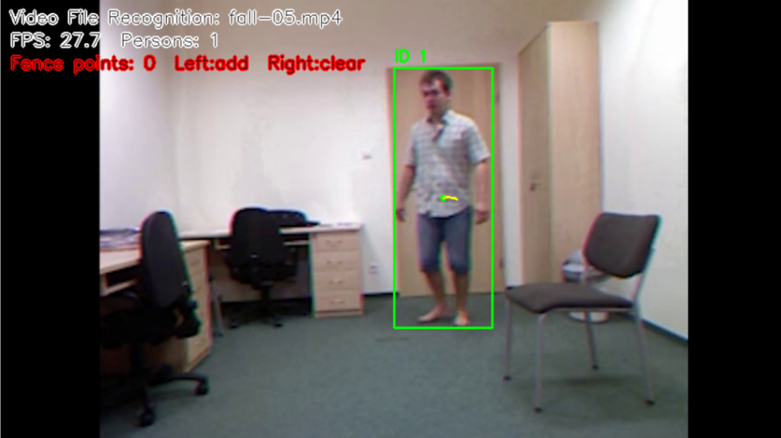
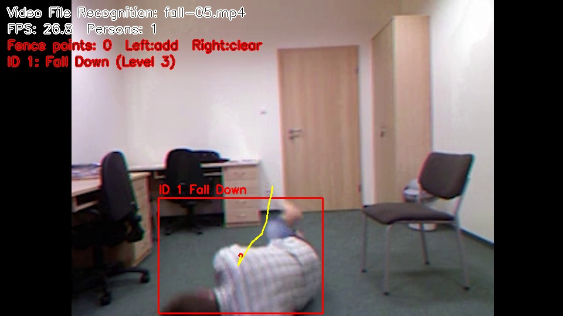
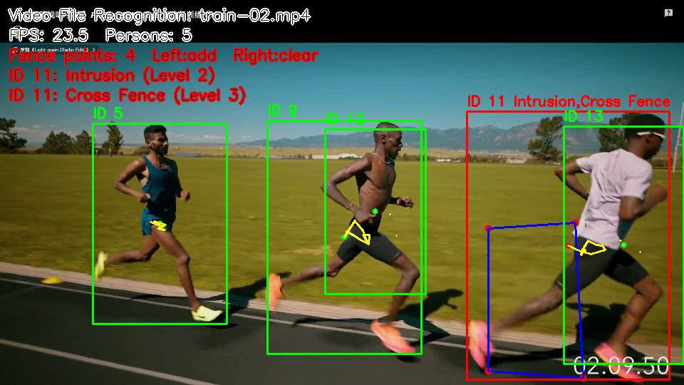
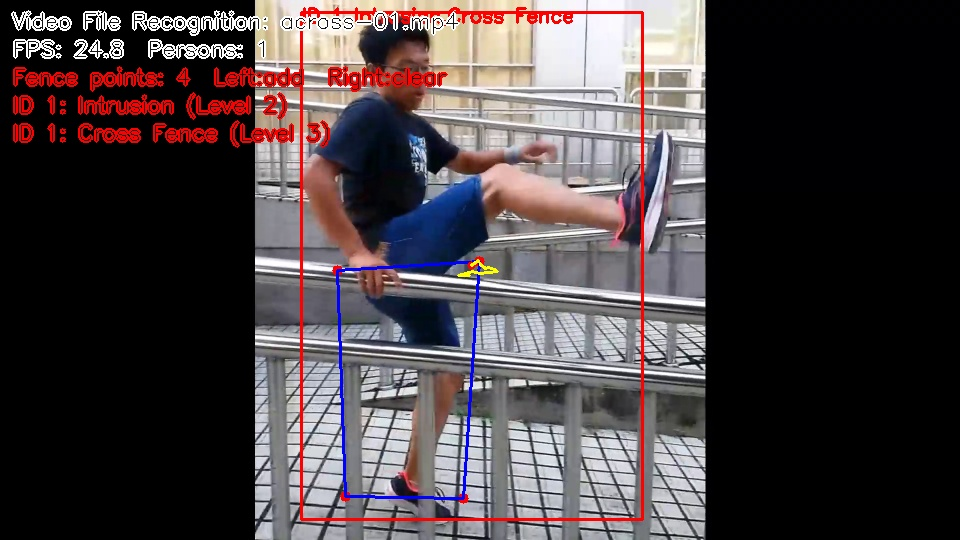

<div align="center">

# Anomaly-Detection-System

**Camera-Based Indoor Abnormal Behavior Recognition System**

[](./README_en.md)
[](./README.md)

</div>

## 1. System Overview and Modules

Anomaly-Detection-System is a camera-based indoor abnormal behavior recognition system for smart homes, indoor equipment rooms, laboratories, children's activity areas, industrial workstations, and other safety-monitoring scenarios. It captures real-time camera streams or local videos with OpenCV, detects human targets with YOLOv8, and combines target tracking, virtual fence analysis, and rule-based behavior recognition to identify illegal intrusion, fence crossing, long-term lingering, fall events, running/fighting, and climbing.

The system provides a PyQt6 graphical interface and supports both camera input and local video input. When an abnormal event is detected, it displays warning information on the video frame and saves alarm screenshots, alarm video clips, and CSV logs for later review.

### Core Modules

| Module | Purpose |
| --- | --- |
| Video Capture | Uses OpenCV to open a camera or read a local video file, then passes real-time frames to the detection pipeline. |
| Human Detection | Uses YOLOv8 to detect human targets in the frame, keeps only the `person` class, and outputs bounding boxes, confidence scores, and class information. |
| Virtual Fence | Lets users add fence vertices with left-click, clear the fence with right-click, connect points into a safety area, and check whether a person's center point is inside the fence. |
| Target Tracking | Assigns person IDs, records movement trajectories and speed changes, and supports continuous behavior analysis such as fence crossing and running. |
| Abnormal Behavior Recognition | Uses bounding-box ratio, position changes, trajectories, speed, and stay duration to detect intrusion, fence crossing, lingering, falling, running, and climbing. |
| Alarm Logging | Triggers warnings by risk level, saves screenshots and video clips, and writes time, source, person ID, alarm type, and file paths to a CSV log. |
| Graphical Interface | Provides real-time display, recognition mode selection, playback control, alarm status display, and alarm record viewing through PyQt6. |

## System Demo

### Fall Detection




### Run Detection



### Intrusion and Fence-Crossing Detection



## 2. System Architecture

The overall workflow is shown below:

```text
+------------------+
| Camera/Video Src |
+--------+---------+
         |
         v
+------------------+
| OpenCV Capture   |
+--------+---------+
         |
         v
+------------------+
| YOLO Detection   |
+--------+---------+
         |
         v
+------------------+
| Tracking/Traj.   |
+--------+---------+
         |
         v
+------------------+
| Virtual Fence    |
+--------+---------+
         |
         v
+------------------+
| Behavior Rules   |
+--------+---------+
         |
         v
+------------------+
| Alarm/Save/Log   |
+------------------+
```

Core processing flow:

```text
Read camera frame
    -> Detect human targets
    -> Assign person ID
    -> Record movement trajectory
    -> Check virtual fence status
    -> Detect abnormal behavior
    -> Display alarm message and save records
```

## 3. Project Structure

```text
Anomaly-Detection-System/
|
|-- main.py                  # Program entry point
|-- ui_main.py               # PyQt6 main interface
|-- detector.py              # YOLO human detection module
|-- tracker.py               # Target tracking module
|-- fence.py                 # Virtual fence drawing and region checking
|-- behavior.py              # Abnormal behavior recognition module
|-- alarm.py                 # Alarm, screenshot, and logging module
|-- video_clip.py            # Alarm video clip recording module
|
|-- models/                  # Model files
|   |-- yolov8n.pt
|
|-- records/                 # Runtime records
|   |-- screenshots/         # Alarm screenshots
|   |-- videos/              # Alarm video clips
|   |-- alarm_log.csv        # Alarm log
|
|-- TrainVedio/              # Default video selection directory
|-- README.md                # Chinese documentation
|-- README_en.md             # English documentation
|-- requirements.txt         # Python dependencies
```

## 4. Technology Stack

| Technology | Purpose |
| --- | --- |
| Python | Main development language |
| OpenCV | Camera capture, image processing, video display, and region drawing |
| PyQt6 | GUI development |
| YOLOv8 | Human target detection |
| NumPy | Coordinate calculation and array processing |
| CSV | Alarm record storage |

Potential extensions:

| Technology | Extended Function |
| --- | --- |
| OpenCV VideoWriter | Save videos with detection boxes |
| SQLite / MySQL | Alarm record querying, statistics, and long-term storage |
| MediaPipe Pose / YOLOv8-Pose | Keypoint-based fall and climbing recognition |

## 5. Dependencies

Main dependencies in `requirements.txt`:

```text
opencv-python
numpy
PyQt6
ultralytics
```

## 6. Current Features

The current code implements a PyQt6-based abnormal behavior recognition system with the following functions:

- Camera or video file input.
- YOLOv8 human detection, with automatic fallback to OpenCV HOG if YOLO fails to load.
- Target tracking based on position, size, and color histogram features.
- Person ID assignment and continuous localization of the same person.
- Fall detection.
- Running detection.
- Climbing detection.
- Multi-level warning display.
- Alarm screenshot saving.
- Alarm log recording.
- Initial interface prompt: `Please select a recognition mode`.
- Right-side buttons for camera recognition or folder video recognition.
- Folder video recognition opens the `TrainVedio` directory by default, allowing the user to select a single video file.

## 7. Usage

Install dependencies:

```bash
pip install -r requirements.txt
```

Start the graphical interface:

```bash
python main.py
```

## 8. Operation Guide

```text
After startup: the video display area shows "Please select a recognition mode"
Recognition mode -> Camera recognition: open the camera for real-time recognition
Recognition mode -> Folder video recognition: open the TrainVedio folder and manually select a video
After selecting a video: the first frame is displayed, but playback does not start automatically
Left-click inside the video area: add virtual fence points
Right-click inside the video area: clear the virtual fence
Play: start recognition for the selected video
After video recognition finishes: click Play again to re-run recognition on the same video
Alarm Records: open a graphical table window to view historical alarm CSV records
Exit Recognition: stop the current recognition task and return to the home screen
Top-right X: exit the entire program
```

Folder video recognition rules:

```text
Video directory: TrainVedio/
The user selects one video file each time
Only the selected video is recognized each time
After recognition finishes, click Play to recognize the current video again
After recognition finishes, click Exit Recognition to return to the home screen
Click Folder Video Recognition again to choose another video
```

Supported video formats:

```text
.mp4
.avi
.mov
.mkv
.wmv
.flv
.m4v
```

## 9. Detection Backend

The system uses YOLOv8 for human detection first. If `ultralytics` is not installed or the model fails to load, the program automatically falls back to OpenCV HOG human detection.

Recommended YOLOv8 installation:

```bash
pip install ultralytics
```

To use a local model, place the model file at:

```text
models/yolov8n.pt
```

If the following file exists in the project root, it will also be loaded automatically:

```text
yolov8n.pt
```

## 10. Same-Person Tracking

The tracking module no longer relies only on center-point distance. It combines the following information to determine whether detections belong to the same person:

```text
Human center-point distance
Human bounding-box size change
HSV color histogram features of the human region
```

This makes person ID assignment more stable when multiple people appear at the same time, short occlusion occurs, or targets move quickly.

## 11. Output Files

Alarm screenshot directories:

```text
records/screenshots/intrusion/      # Illegal intrusion screenshots
records/screenshots/cross_fence/    # Fence-crossing screenshots
records/screenshots/fall_down/      # Fall screenshots
```

Alarm video clip directories:

```text
records/videos/intrusion/           # Illegal intrusion clips
records/videos/cross_fence/         # Fence-crossing clips
records/videos/fall_down/           # Fall clips
```

Alarm log file:

```text
records/alarm_log.csv
```

Alarm log fields:

```text
time,source,track_id,alarm_type,alarm_name,level,screenshot,video_clip
```

## 12. Multi-Level Warnings

The system divides abnormal behaviors into three warning levels according to risk severity:

| Warning Level | Trigger Behavior | Interface Display |
| --- | --- | --- |
| Level 1 | Running, long-term lingering | Yellow warning |
| Level 2 | Illegal intrusion, climbing | Orange warning |
| Level 3 | Fence crossing, fall detection | Red warning |

Multi-level warnings are displayed in the real-time status label, the right-side data panel, and the alarm record table. They are also written to the `level` field in the alarm log.

The system currently saves screenshots, alarm video clips, and CSV records for the following alarm types:

```text
intrusion    Illegal intrusion
cross_fence  Fence crossing
fall_down    Fall detection
```

The screenshot is the recognition frame at the moment the alarm is triggered, including the human bounding box, person ID, virtual fence, and alarm text.

Alarm video clips are saved using a "3 seconds before alarm + 5 seconds after alarm" strategy. If the video starts or ends before the full duration can be collected, the actual available segment is saved.

To reduce UI stutter and memory usage during long-running sessions, alarm clip recording uses the following protection strategies:

```text
Video clips are written in a background thread to avoid blocking the PyQt6 UI
At most 3 alarm clips can be recorded at the same time
Alarm clip FPS is capped at 20 FPS
If screenshot, CSV, or clip saving fails, the right-side data panel displays an error message
```

## 13. Current Code Files

```text
main.py          # Program entry point
ui_main.py       # PyQt6 graphical interface
detector.py      # Human detection, with YOLO and HOG fallback
tracker.py       # Simple centroid-based target tracking
fence.py         # Virtual fence drawing and region checking
behavior.py      # Abnormal behavior rule detection
alarm.py         # Alarm screenshot and log saving
video_clip.py    # Alarm video clip saving before and after alarms
```

